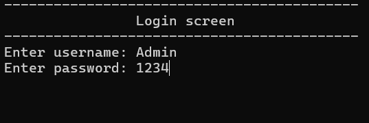
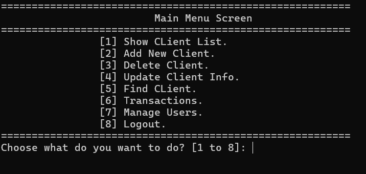
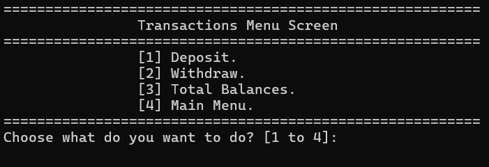
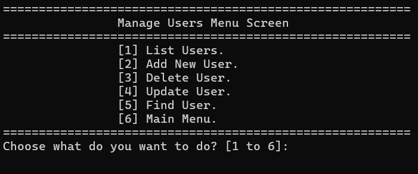

<div align="center">

# 🏦 Bank Management System

A feature-rich **Bank Management System** built with **C++**, demonstrating file handling, modular programming, role-based access control, and banking transaction management.

<p>


</p>

*A personal portfolio project showcasing software engineering fundamentals and practical C++ development.*

</div>

---

# 📑 Table of Contents

- 📖 Overview
- ✨ Features
- 🖼️ Screenshots
- 🛠️ Technologies
- 📂 Project Structure
- 🔐 Permission System
- 💾 Data Storage
- 🌟 Implementation Highlights
- 🚀 Future Improvements
- 🤝 Contributing
---

# 📖 Overview

The **Bank Management System** is a console-based application developed in **C++** that simulates core banking operations.

The system allows authorized employees to:

- 👥 Manage client accounts
- 💰 Perform banking transactions
- 👨‍💼 Manage system users
- 🔐 Control access using binary permissions

This project demonstrates:

- Modular Programming
- File Handling
- Structured Programming
- Data Persistence
- Bitwise Operations
- Software Design Principles

---

# ✨ Features

## 🔑 Authentication
- Secure username/password login
- Session-based authentication

## 🛡️ Role-Based Access Control
- Binary (bitwise) permission system
- Feature-level authorization
- Administrator privileges
- Access denied protection

## 👥 Client Management
- 📋 List Clients
- ➕ Add Client
- ✏️ Update Client
- ❌ Delete Client
- 🔍 Find Client

## 💰 Transactions
- 💵 Deposit
- 💸 Withdraw
- 📊 View Client Balances
- 🏦 Calculate Total Bank Balance
- ✅ Withdrawal validation

## 👨‍💼 User Management
- 👤 List Users
- ➕ Add Users
- ✏️ Update Users
- ❌ Delete Users
- 🔍 Find Users
- 🔐 Assign Permissions

## 💾 Data Persistence
- File-based storage
- Automatic loading and saving
- Separate client and user databases

---

# 🖼️ Screenshots

Create an `images/` folder and replace these placeholders with screenshots.

| Login | Main Menu |
|--------|-----------|
|  |  |

| Transactions | Manage Users |
|--------------|--------------|
|  |  |

---

# 🛠️ Technologies

| Technology | Purpose |
|------------|---------|
| C++ | Core programming language |
| STL | Containers & algorithms |
| fstream | File persistence |
| Bitwise Operations | Permission management |
| Console I/O | User interface |

---

# 📂 Project Structure

```text
Bank-System/
│
├── BankSystemFile.cpp
├── CLients Bank System.txt
├── Users Bank System.txt
├── images/
└── README.md
```

---

# 🔐 Permission System

| Permission | Value |
|------------|------:|
| Show Client List | 1 |
| Add Client | 2 |
| Delete Client | 4 |
| Update Client | 8 |
| Find Client | 16 |
| Transactions | 32 |
| Manage Users | 64 |
| Full Access | -1 |

Permissions are combined using bitwise operators to efficiently control feature access.

---

# 💾 Data Storage

Client format:

```text
AccountNumber#//#PinCode#//#Name#//#Phone#//#Balance
```

User format:

```text
Username#//#Password#//#Permission
```

---

# 🌟 Implementation Highlights

- ✅ Modular architecture using 70+ functions
- ✅ Complete CRUD operations
- ✅ Binary permission system
- ✅ File-based persistence
- ✅ Deposit and withdrawal validation
- ✅ Automatic balance calculations
- ✅ Duplicate account detection
- ✅ Administrator protection

---

# 🚀 Future Improvements

- Object-Oriented redesign
- SQLite/MySQL integration
- Password hashing
- Transaction history
- Money transfers
- Unit testing
- GUI using Qt or Flutter

---

# 🤝 Contributing

This repository was created as a personal portfolio project.

Pull requests for bug fixes, performance improvements, and new features are welcome.

---

<div align="center">

### ⭐ If you found this project useful, consider giving it a star!

Made with ❤️ using C++

</div>
